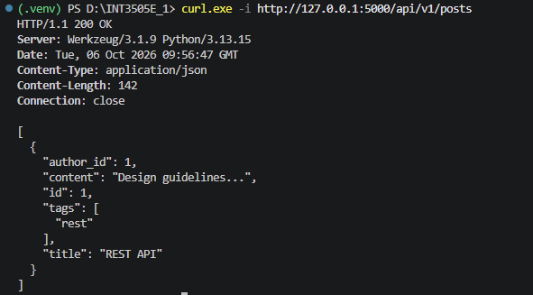
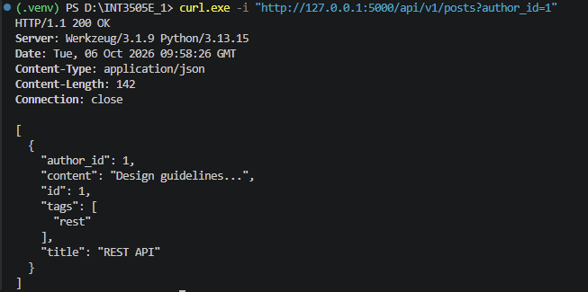
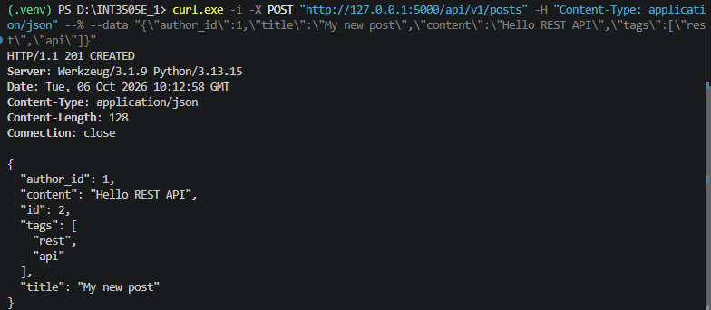
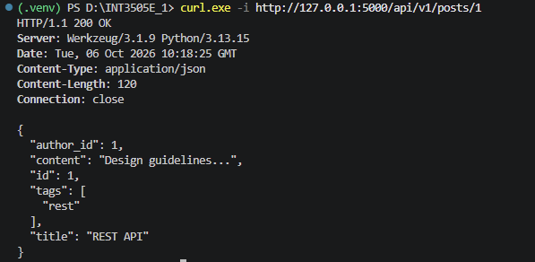
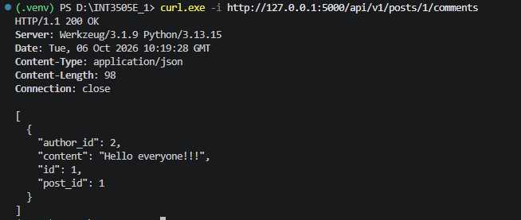

## 1. GET tất cả `posts` - 200 OK
Lệnh powershell: `curl.exe -i http://127.0.0.1:5000/api/v1/posts`

Kết quả:

## 2. GET posts theo `author_id`
Lệnh powershell: `curl.exe -i "http://127.0.0.1:5000/api/v1/posts?author_id=1"`

Kết quả:

## 3. Tạo `post` thành công — 201 Created
Lệnh powershell: `curl.exe -i -X POST "http://127.0.0.1:5000/api/v1/posts" -H "Content-Type: application/json" --% --data "{\"author_id\":1,\"title\":\"My new post\",\"content\":\"Hello REST API\",\"tags\":[\"rest\",\"api\"]}"`

Kết quả:

## 4. GET một `post` tồn tại — 200
Lệnh powershell: `curl.exe -i http://127.0.0.1:5000/api/v1/posts/1`

Kết quả:

## 5. GET `comments` của `post` tồn tại
Lệnh powershell: `curl.exe -i http://127.0.0.1:5000/api/v1/posts/1/comments`

Kết quả:

