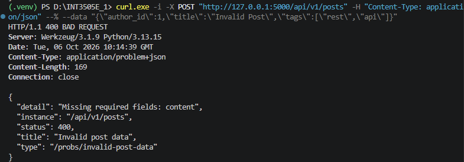
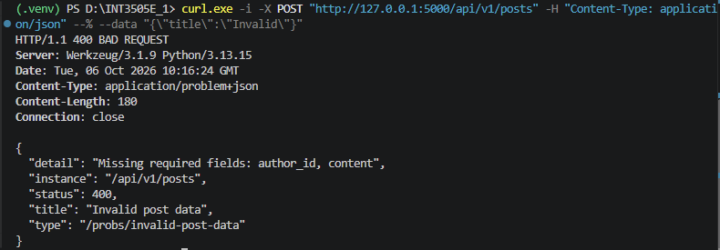
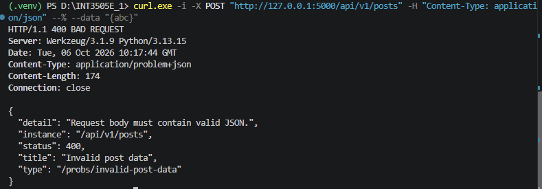
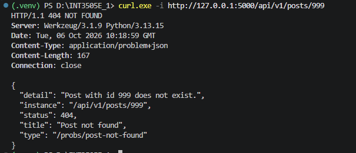
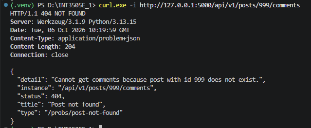

## 1. Tạo `post` thiếu 1 thành phần - 400 Bad Request
Lệnh powershell: `curl.exe -i -X POST "http://127.0.0.1:5000/api/v1/posts" -H "Content-Type: application/json" --% --data "{\"author_id\":1,\"title\":\"Invalid Post\",\"tags\":[\"rest\",\"api\"]}"`

Kết quả:

## 2. Tạo `post` thiếu nhiều thành phần - 400 Bad Request
Lệnh powershell: `curl.exe -i -X POST "http://127.0.0.1:5000/api/v1/posts" -H "Content-Type: application/json" --% --data "{\"title\":\"Invalid\"}"`

Kết quả:

## 3. Test JSON không hợp lệ - 400 Bad Request
Lệnh powershell: `curl.exe -i -X POST "http://127.0.0.1:5000/api/v1/posts" -H "Content-Type: application/json" --% --data "{abc}"`

Kết quả:

## 4. GET một post không tồn tại — 404 Not Found
Lệnh powershell: `curl.exe -i http://127.0.0.1:5000/api/v1/posts/999`

Kết quả:

## 5. GET comments của post không tồn tại — 404 Not Found
Lệnh powershell: `curl.exe -i http://127.0.0.1:5000/api/v1/posts/999/comments`

Kết quả:

