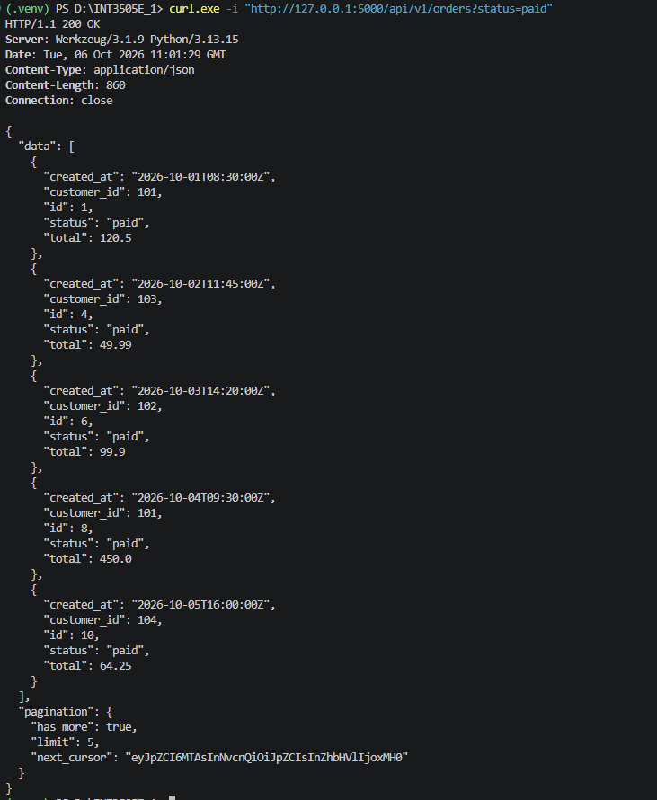
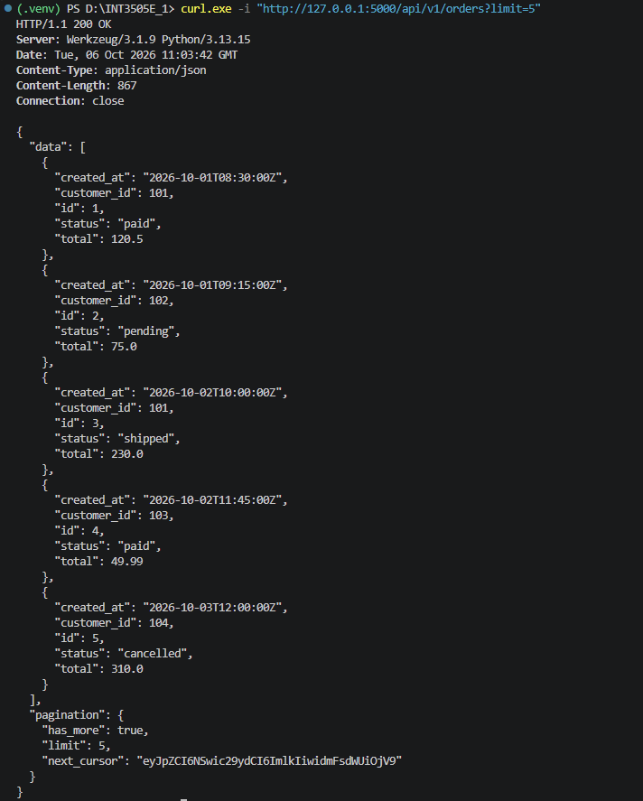
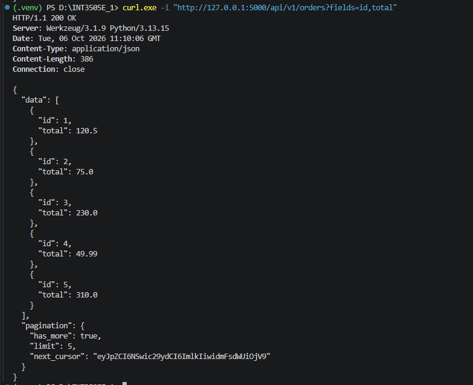
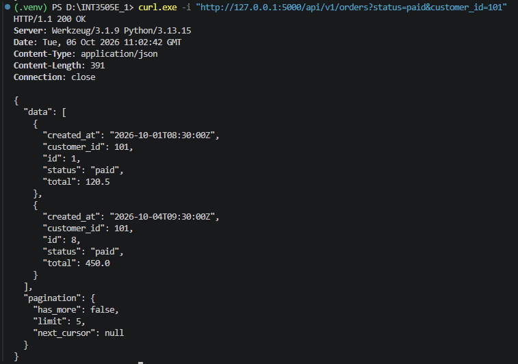
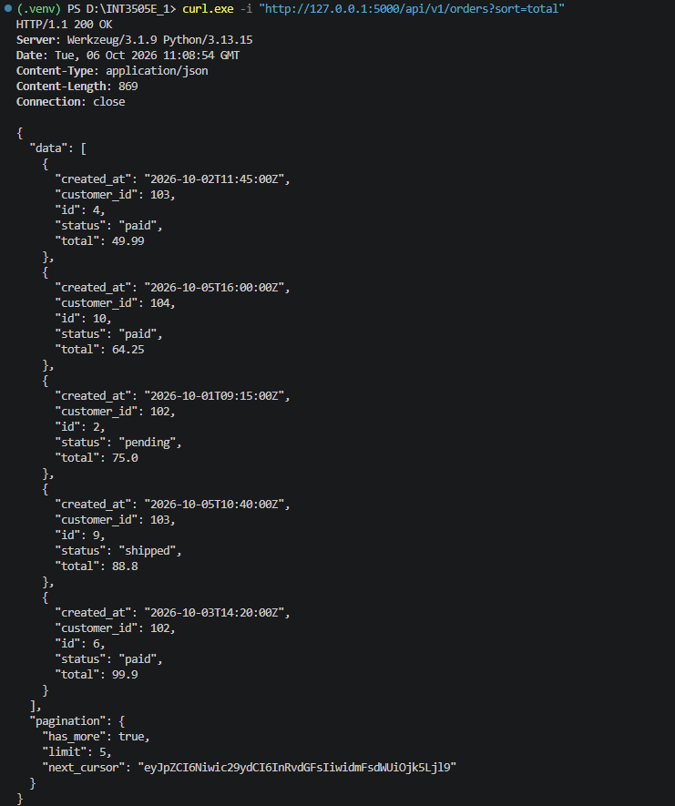
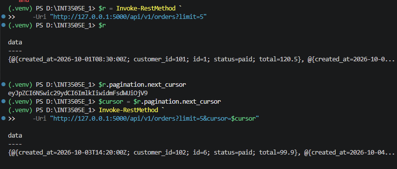
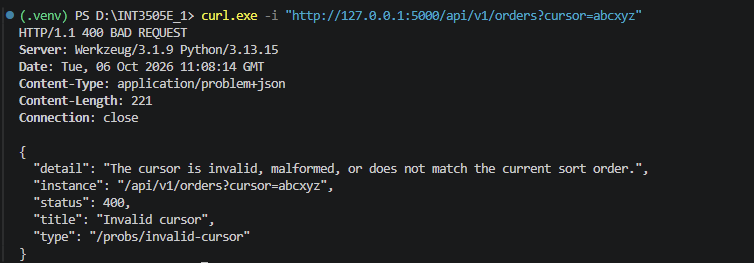
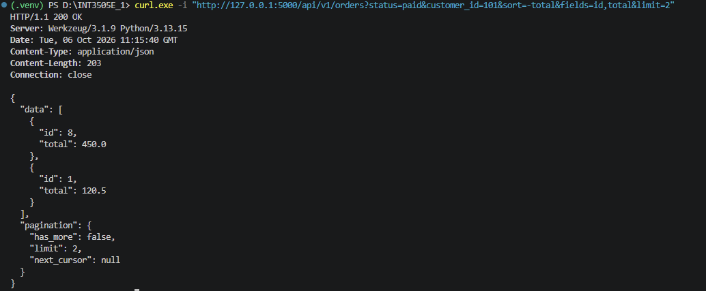

## 1. GET `orders` theo `status`
Lệnh powershell: `curl.exe -i "http://127.0.0.1:5000/api/v1/orders?status=paid"`

Kết quả:

## 2. GET `orders` với `limit=5`
Lệnh powershell: `curl.exe -i "http://127.0.0.1:5000/api/v1/orders?limit=5"`

Kết quả:

## 3. GET `orders` với sparse fieldsets
Lệnh powershell: `curl.exe -i "http://127.0.0.1:5000/api/v1/orders?fields=id,total"`

Kết quả:

## 4. GET `orders` theo `customer_id`
Lệnh powershell: `curl.exe -i "http://127.0.0.1:5000/api/v1/orders?customer_id=101"`

Kết quả:

## 5. GET `orders` với `sort`
Lệnh powershell: `curl.exe -i "http://127.0.0.1:5000/api/v1/orders?sort=-total"`

Kết quả:

## 6. Cursor pagination - lấy trang tiếp theo
Trước tiên lấy trang đầu với `limit=5`:

Lệnh powershell: `$r = Invoke-RestMethod -Uri "http://127.0.0.1:5000/api/v1/orders?limit=5"`

Lấy `next_cursor`:

Lệnh powershell: `$cursor = $r.pagination.next_cursor`

Dùng cursor để lấy trang tiếp theo:

Lệnh powershell: `Invoke-RestMethod -Uri "http://127.0.0.1:5000/api/v1/orders?limit=5&cursor=$cursor"`

Kết quả:

## 7. Cursor không hợp lệ - 400 Bad Request
Lệnh powershell: `curl.exe -i "http://127.0.0.1:5000/api/v1/orders?cursor=abcxyz"`

Kết quả:

## 8. Kết hợp filter, sort, sparse fieldsets và limit
Lệnh powershell: `curl.exe -i "http://127.0.0.1:5000/api/v1/orders?status=paid&customer_id=101&sort=-total&fields=id,total&limit=2"`

Kết quả:

